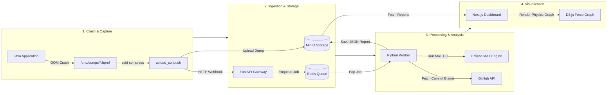

# Project JPoint

An automated heap dump processor and memory leak analyzer for Java applications. When a Java process throws an `OutOfMemoryError`, JPoint compresses the heap dump, runs headless Eclipse MAT analysis, matches leaking classes against Git commit history using Git Blame, and presents the findings on a web dashboard.

---

## What It Does

1. **Dump Capture & Compression**: Collects `.hprof` heap dumps from `/tmp/dumps`, stream-compresses them using `zstd`, and uploads them to MinIO.
2. **Headless Heap Parsing**: Runs Eclipse Memory Analyzer Tool (MAT) in CLI mode (`org.eclipse.mat.api:suspects`) to identify leak suspects without launching a GUI.
3. **Git Blame Integration**: Queries the GitHub API for identified leaking classes to find the commit author, commit hash, file path, and commit message responsible for the code.
4. **Interactive Dashboard**: Displays analysis reports in a Next.js dashboard, including a D3.js force-directed graph showing memory distribution per suspect class.
5. **Request Tracing**: Uses OpenTelemetry and Jaeger to trace job execution across services, with Redis handling async job queuing.

---

## Architecture



---

## Component Overview

* **`capture-layer/`**: Contains benchmark Java classes that trigger memory leaks (`DistributedPipelineCluster.java`, `TenantContextCacheManager.java`, `EnterpriseOrderProcessor.java`, `DistributedLeakBenchmark.java`, `ComplexOOM.java`) and `upload_script.sh` to compress and send dumps to MinIO.
* **`api-gateway/`**: A FastAPI application that receives upload webhooks, generates job IDs, creates OpenTelemetry spans, and pushes work onto Redis.
* **`worker-node/`**: A Python background process (`worker.py`) that pops jobs from Redis, decompresses `.zst` files, executes Eclipse MAT CLI, parses the HTML report, fetches Git commit data from GitHub, and writes output JSON files back to MinIO.
* **`frontend/`**: Next.js 14 web application featuring an S3 API reader route (`src/app/api/reports/route.ts`) and a D3 force-directed visualizer (`src/components/LeakGraph.tsx`).

---

## Tech Stack

* **Frontend**: Next.js 14, React, Tailwind CSS, D3.js
* **API Gateway**: FastAPI, Uvicorn, OpenTelemetry, Redis Py
* **Worker Node**: Python 3.10+, MinIO SDK, `zstandard`, BeautifulSoup4, Requests
* **Parser Engine**: Eclipse MAT (Memory Analyzer Tool) 1.17 CLI
* **Services**: MinIO, Redis, Jaeger (via Docker Compose)

---

## Prerequisites

* Docker and Docker Compose
* Java JDK (8+)
* Python 3.10+
* Node.js 18+
* `zstd` command-line tool
* AWS CLI (`aws-cli` for S3 upload script)

---

## Quick Start

### 1. Configure Environment

Create a `.env` file in the project root if you want Git Blame integration:

```bash
GITHUB_TOKEN=your_github_personal_access_token
```

### 2. Start Services

Start Docker containers, the Python worker, and the Next.js frontend using `run.sh`:

```bash
./run.sh
```

Service endpoints once running:
* Dashboard: http://localhost:3000
* API Gateway Docs: http://localhost:8000/docs
* MinIO Web Console: http://localhost:9001 (`admin` / `password123`)
* Jaeger UI: http://localhost:16686

### 3. Stop Services

To shut down background workers and Docker containers:

```bash
./stop.sh
```

---

## Running a Test Memory Leak

1. Create the dump target directory:
   ```bash
   mkdir -p /tmp/dumps
   ```

2. Compile and run one of the benchmark scenarios:
   ```bash
   cd capture-layer
   javac DistributedPipelineCluster.java
   java -Xmx256m -XX:+HeapDumpOnOutOfMemoryError -XX:HeapDumpPath=/tmp/dumps DistributedPipelineCluster
   ```

   *Note: Do not add a trailing slash to `-XX:HeapDumpPath=/tmp/dumps`. Point directly to the directory path.*

3. Once an `OutOfMemoryError` occurs, run the capture script:
   ```bash
   ./upload_script.sh
   ```

4. Open http://localhost:3000 in your browser to view the generated analysis card and leak graph.

---

## Directory Layout

```text
project-jpoint/
├── api-gateway/            # FastAPI webhook gateway
│   ├── Dockerfile
│   ├── main.py
│   └── requirements.txt
├── capture-layer/          # Java test scenarios and upload script
│   ├── DistributedPipelineCluster.java
│   ├── TenantContextCacheManager.java
│   ├── EnterpriseOrderProcessor.java
│   ├── DistributedLeakBenchmark.java
│   ├── ComplexOOM.java
│   ├── TestOOM.java
│   └── upload_script.sh
├── frontend/               # Next.js dashboard
│   ├── src/app/
│   │   ├── api/reports/route.ts
│   │   ├── page.tsx
│   │   └── globals.css
│   └── src/components/
│       └── LeakGraph.tsx
├── worker-node/            # Python background worker
│   ├── mat/                # Eclipse MAT distribution
│   ├── worker.py
│   ├── debug.py
│   └── requirements.txt
├── docker-compose.yml
├── run.sh
├── stop.sh
└── README.md
```

---

## Troubleshooting

### `Unable to create /tmp/dumps/: Is a directory`
This happens when a trailing slash is passed to `-XX:HeapDumpPath=/tmp/dumps/`. HotSpot JVM expects the directory path without a trailing slash (e.g., `-XX:HeapDumpPath=/tmp/dumps`).

### `No .hprof heap dump found in /tmp/dumps!`
Ensure `/tmp/dumps` exists and that `-Xmx` was set low enough to trigger an `OutOfMemoryError` during execution.

---

## License

MIT
